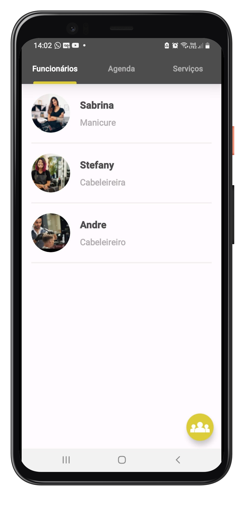
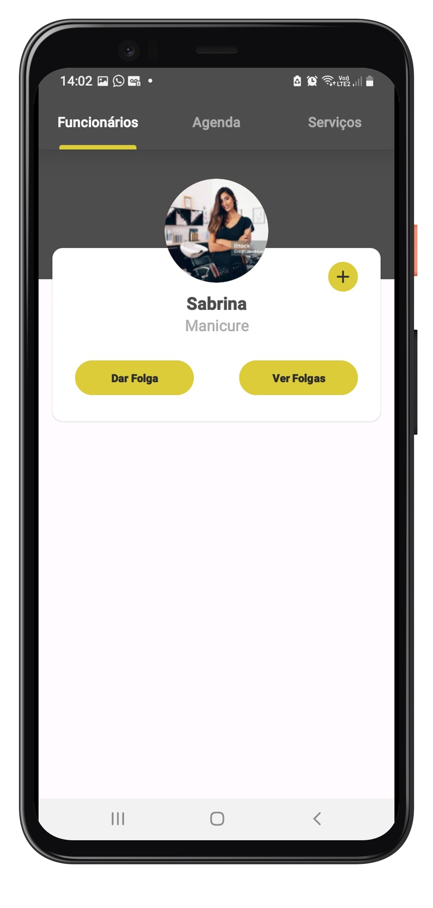
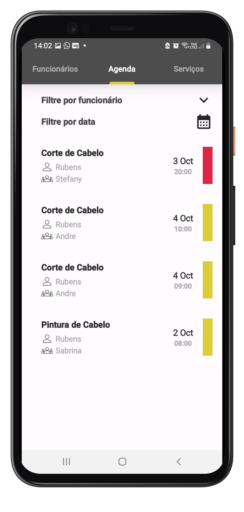
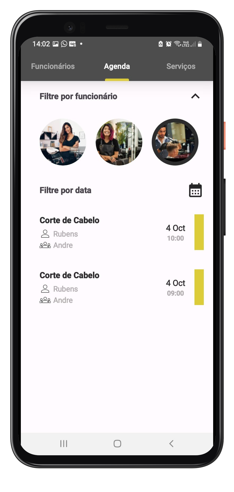
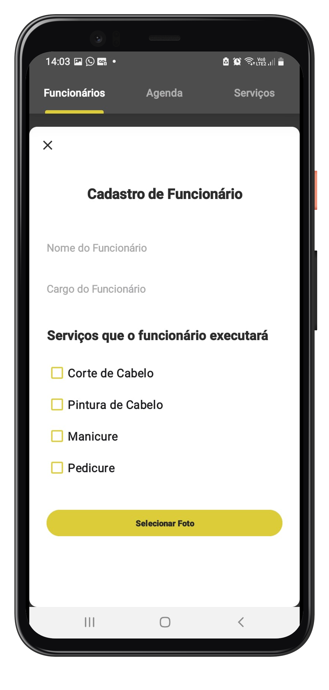
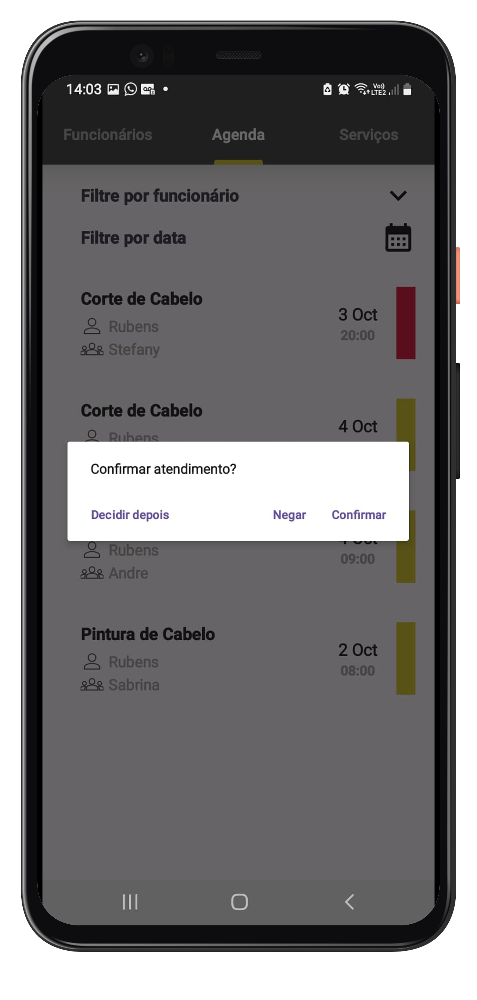
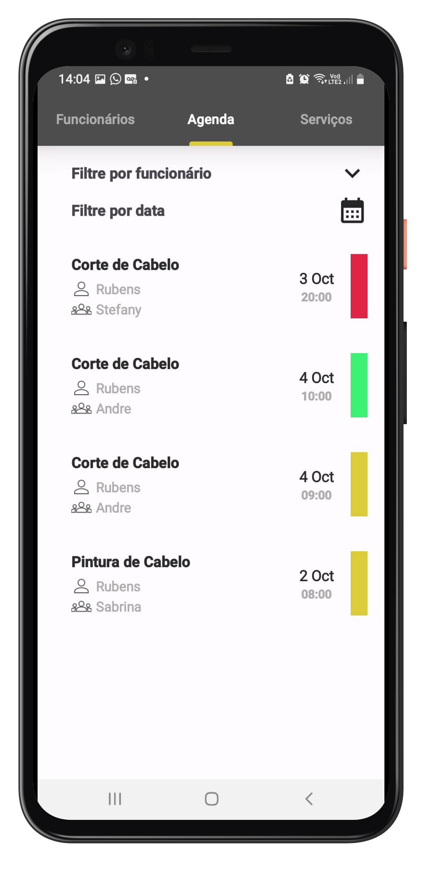
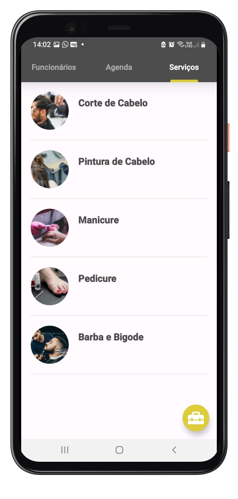

English:
<h1 align="center">Salon Admin Premium</h1>

<p align="center">
  <a href="https://opensource.org/licenses/Apache-2.0"></a>
  <a href="https://android-arsenal.com/api?level=24"></a>
  <br>
  <a href="https://wa.me/+5511961422254"></a>
  <a href="https://www.linkedin.com/in/rubens-francisco-125529162/"></a>
  <a href="mailto:rubens_assis@outlook.com.br"></a>
</p>

<p align="center">  

⭐ This is a project to demonstrate my ability in native Android development with Kotlin. More technical information below.

✂️ Salon Admin Premium is an Android application that allows employees and/or administrators of a beauty salon to monitor all appointments booked by customers on the customer's app (Salon Premium Client).

</p>

</br>

<p float="left" align="center">












</p>

## App Download

Download the app <a href="apk/app-debug.apk?raw=true">APK directly</a>. You can see here <a href="https://www.google.com/search?q=como+instalar+um+apk+no+android">here</a> how to install an apk on your android device!

## Technologies used

- Minimum SDK level 24
- [Linguagem Kotlin](https://kotlinlang.org/)

- Android SDK components that were used:
   - ViewPager2: Used to facilitate navigation between fragments of my app. I integrated it with a tabLayout to be able to easily navigate between my fragments.
   - viewModel: It is part of the MVVM that I used to organize my project. My viewModels serve as access to my data source access repositories (which in this case are some Firebase APIs) and this class also has as members variables that, if updated, should trigger some change on the screen.
   - fragment: in this project I used fragments to organize the logic of my different screens.
   - SharedFlow: This component comes from the kotlin libraries and helps me provide a component that tells the screen that it needs to be updated. I chose sharedFlow because, at first, I didn't want to store the values already emitted in cache. But maybe I'll change that in the future.
   - viewBinding: This library helps me a lot when I use xmls to make my screens. I can easily access layout components without having to write much.

- Other dependencies:
   - CircleImageView: I used this github library to use rounded imageviews and borders to represent selections. It's a library that I've been using for some time because it works very well when I'm using xmls.
   - DaggerHilt: Amazing library that makes it easy to inject dependencies into my classes. You can divide everything into modules and leave everything separate, so each object goes where it needs to go and sometimes without creating repeated instances.
   - Glide: I used the glide too. This library is mainly useful when you want to consume an image that comes from a url and perform transformations on the image.
   - FirebaseDatabase: I used the firebase database to save things that needed to be persisted such as new employees, services, days off, scheduling status, etc.
   - FirebaseStorage: I used it to save photo files such as employee photos.
## Architecture
In this app I used the [MVVM] architecture, which is an architecture that I have been using for a long time to organize my code, making it more readable and scalable.
(https://developer.android.com/topic/architecture).
</br></br>

## Main Functionalities

### Register all employees who work in the salon


### Follow the appointment schedule by date or employee


### Confirm or decline calls


### Register new services that will be offered to your customers


Português:
<h1 align="center">Salon Admin Premium</h1>

<p align="center">
  <a href="https://opensource.org/licenses/Apache-2.0"></a>
  <a href="https://android-arsenal.com/api?level=24"></a>
  <br>
  <a href="https://wa.me/+5511961422254"></a>
  <a href="https://www.linkedin.com/in/rubens-francisco-125529162/"></a>
  <a href="mailto:rubens_assis@outlook.com.br"></a>
</p>

<p align="center">  

⭐ Esse é um projeto para demonstrar minha capacidade no desenvolvimento Android nativo com Kotlin. Mais informações técnicas abaixo.

✂️ Salon Admin Premium é um aplicativo para android que possibilita que funcionários e/ou administradores de um salão de beleza, acompanhem todos os atendimentos marcados pelos clientes no app do cliente(Salon Premium Client).

</p>

</br>

<p float="left" align="center">


</p>

## Download do App

Faça o download do <a href="apk/app-debug.apk?raw=true">APK diretamente</a>. Você pode ver <a href="https://www.google.com/search?q=como+instalar+um+apk+no+android">aqui</a> como instalar um APK no seu aparelho android!

## Tecnologias usadas

- Minimum SDK level 24
- [Linguagem Kotlin](https://kotlinlang.org/)

- Componentes da SDK do android que foram utilizados:
  - ViewPager2: Utilizado para facilitar a navegação entre os fragments do meu app. Fiz a integração com uma tabLayout para conseguir navegar facilmente entre meus fragmentos.
  - viewModel: Faz parte do MVVM que usei para organizar meu projeto. Minhas viewModels servem como acesso aos meus repositories de acesso a data source(que nesse caso são algumas apis do firebase) e essa classe tambem tem como membros as variaveis que se atualizadas devem desencadear alguma mudança na tela.
  - fragment: nesse projeto utilizei fragments para organizar a lógica das minhas diferentes telas.
  - SharedFlow: Esse componente vem das bibliotecas do kotlin e me ajuda a fornecer um componente que avisa à tela que precisa ser atualizada. Escolhi o sharedFlow pois, à princípio, não queria guardar os valores já emitidos em cache. Mas talvez eu mude isso no futuro.
  - viewBinding: Essa biblioteca me ajuda muito quando eu utilizo xmls para fazer minhas telas. Eu consigo acessar facilmente os componentes dos layouts sem ter que escrever muito.

- Outras dependências:
  - CircleImageView: utilizei essa biblioteca do github para usar imageviews arredondadas e bordas para representar seleções. É uma biblioteca que já utilizo há algum tempo porque funciona muito bem quando estou usando xmls.
  - DaggerHilt: Biblioteca incrível que facilita a injeção de dependências nas minhas classes. Você pode dividir tudo por modulos e deixar tudo bem separadinho, para cada objeto ir para onde precisa ir e as vezes sem criar instancias repetidas.
  - Glide: usei o glide também. Essa biblioteca é principalmente útil quando você quer consumir uma imagem que vem de uma url e já fazer transformações na imagem.
  - FirebaseDatabase: Utilizei o banco de dados do firebase para salvar coisas que precisavam ser persistidas como novos funcionários, serviços, folgas, status de agendamento e etc.
  - FirebaseStorage: usei para salvar arquivos de foto como a foto dos funcionários.
 
## Arquitetura
Nesse app utilizei a arquitetura [MVVM] que é uma arquitetura que já uso há bastante tempo para organizar meu código deixando-o mais legível e escalável.
(https://developer.android.com/topic/architecture).
</br></br>

## Principais Funcionalidades

### Cadastre todos os funcionários que atendem no salão


### Acompanhe a agenda de atendimentos por data ou funcionpario


### Confirme ou recuse atendimentos


### Cadastre serviços novos que serão ofertados aos seus clientes


# Licença


```xml
    Copyright [2023] [Rubens Francisco de Assis]

   Licensed under the Apache License, Version 2.0 (the "License");
   you may not use this file except in compliance with the License.
   You may obtain a copy of the License at

     http://www.apache.org/licenses/LICENSE-2.0

   Unless required by applicable law or agreed to in writing, software
   distributed under the License is distributed on an "AS IS" BASIS,
   WITHOUT WARRANTIES OR CONDITIONS OF ANY KIND, either express or implied.
   See the License for the specific language governing permissions and
   limitations under the License.

```


